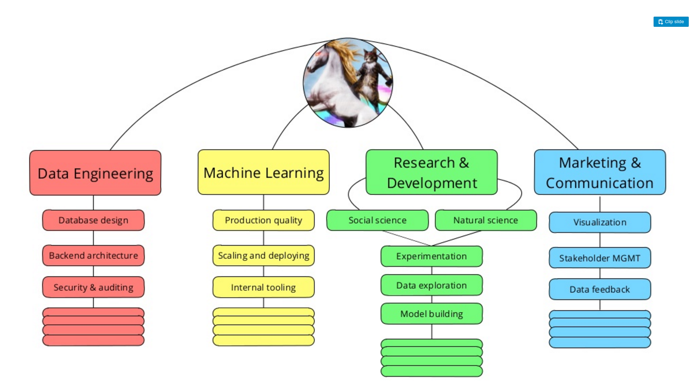
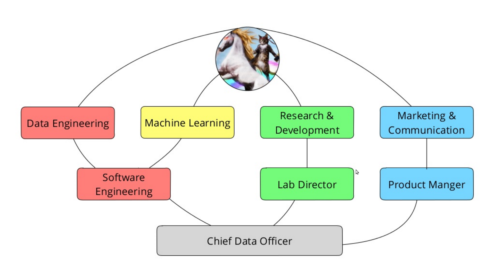
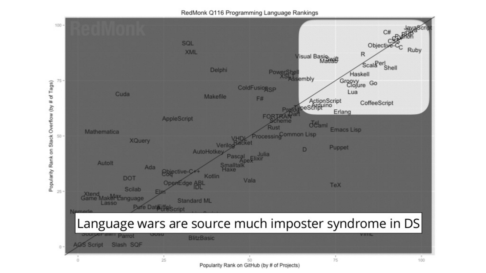

```{r setup, include=FALSE}
knitr::opts_chunk$set(echo = FALSE)
```

# Hi!

## I'm Daniel

<center>

</center>

## Who am I?

- Graduate Student @ Virginia Tech
    - Social and Decision Analytics Laboratory
    - Network Dynamics and Simulation Science Laboratory
- [Software](http://software-carpentry.org/)/[Data](http://www.datacarpentry.org/) Carpentry Instructor
    - [R Inflammation-Lesson Maintainer](http://swcarpentry.github.io/r-novice-inflammation/)
- Arch User Repository (AUR) maintainer for  
    [`rstudio-desktop-preview-bin`](https://aur.archlinux.org/packages/rstudio-desktop-preview-bin/)
- My past:
    - BA Psychology; concentration in Behavioral Neuroscience
        - Minor in Computer Science and Biology
        - Macaulay Honors College at CUNY Hunter College
    - MPH Epidemiology
        - Columbia University Mailman School of Public Health

## What is data science?

Drew Conway:

<center>

</center>

## What is data science?

Hadley Wickham:

> “There are definitely some academic statisticians who just don’t understand why what I do is statistics, but basically I think they are all wrong . What I do is fundamentally statistics. **The fact that data science exists as a field is a colossal failure of statistics.** To me, that is what statistics is all about. It is gaining insight from data using modelling and visualization. Data munging and manipulation is hard and statistics has just said that’s not our domain.”

http://priceonomics.com/hadley-wickham-the-man-who-revolutionized-r/

## What is data science?

<center>

</center>

http://sharpwriter.deviantart.com/art/Welcome-to-the-Internet-Please-Follow-me-322248378

## What is data science?

<center>

</center>

## What is data science?

<center>

</center>

## What language should I use?

<center>

</center>